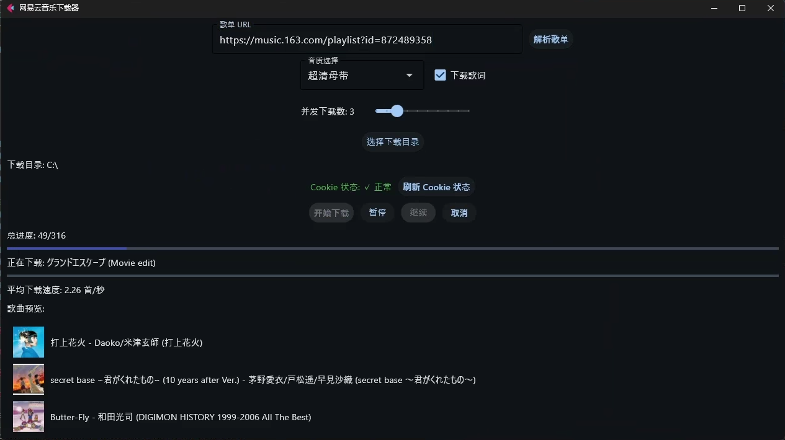
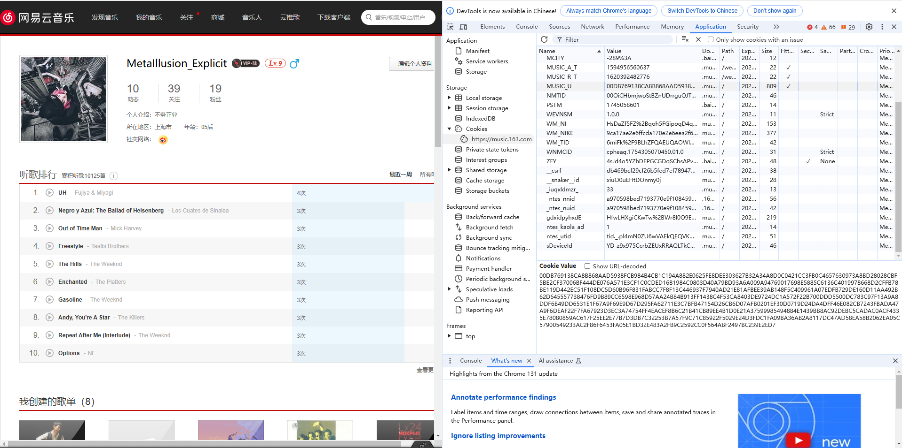

# M163DownList


> An application to download unlimited amount of music from Netease playlist.
> 一个可以无限制下载网易云音乐歌单的应用


## 界面



### 特色

**Cookie 登录 绕过每月400首额度 直接保存为 `MP3`、`FLAC`格式**

## 开始准备

你需要准备：

1. 一台正常的电脑 安装了一个正常的浏览器
2. 网易云音乐账号（建议用有黑胶VIP的，没有VIP会有歌曲下载不了）
3. 一个正常的脑子

## 使用方法

1. 到Release中下载

2. 打开网页版，获取并复制网易云音乐的用户Cookie：下图中的`MUSIC_U`

   

3. ~~下载项目中的cookie.txt演示文件（仅供格式展示），覆盖原来的`MUSIC_U`变量~~

4. 运行程序，填入歌单链接，点击解析，选择下载音质、下载目录和并发数，点击下载

5. Enjoy :D

## docker 部署

默认端口为 5000，可以自行修改 docker-compose.yml 中的映射

```
git clone https://github.com/AyasukaRan/M163DownList
cd M163DownList
docker compose up -d
```

## 开发环境

Python >= 3.10

## 更新的东西

- [ ] 优化软件体积大小
- [x] 优化jy*等格式文件，现在根据文件头判断是 mp3 还是 flac
- [x] 优化jy*等格式元数据写入，现在 flac 的封面等信息可以正常写入
- [x] 实现多线程下载，支持 1-10 并发下载，个人测试 10 并发下载，可以到 5Gbps 左右下载速度
- [x] 优化 cookie 文件，现在会在 gui 显示 cookie 状态，同时检查本地是否存在 cookie，没有会自动创建并跳转网易云
- [x] 支持 docker 部署

## 备注

1. 本项目仅供学习，不为盈利。请不要用于商业用途，或者在咸鱼上转卖，传播等请联系本人，不要随意传播。
2. 本项目基于 [NeteaseUrl](https://github.com/Suxiaoqinx/Netease_url) 和 [DownList](https://github.com/xxxkjing/DownList) ，感谢 [Suxiaoqinx大大](https://github.com/Suxiaoqinx) ；~~以及后面可能不会在这个项目上花太多时间了，~~欢迎大佬fork过去继续开发
3. 如果你很闲，你可以来逛一逛原作者[的博客](https://xia.shfu.cn/)XD
